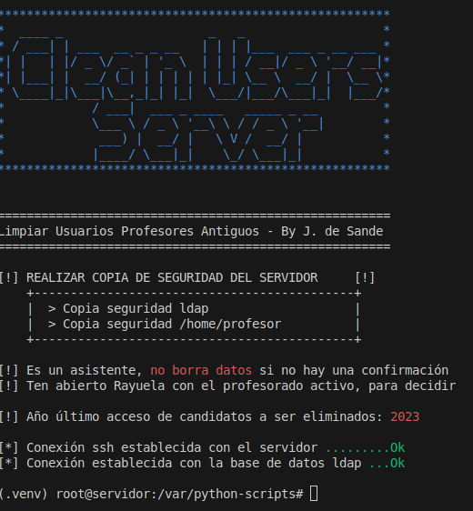

# Asistente para la limpieza de usuarios antiguos del sistema.

## Objetivo 
Estos scripts asisten interactivamente para borrar usuarios del sistema cuya fecha de último acceso sea anterior a una dada.
Compara el último acceso a el sistema del usuario y si es anterior a él año indicado por la variable **"anio_ultimo_acceso"**
va a considerar que este usuario es un candidato a ser eliminado.
Para candidato podemos decidir si eliminar el usuario, eliminándolo de la base de datos ldap como su directorio del /home del servidor.
* El script **no borra datos** sin confirmar!
* Lo ideal es contrastar con información de los profesores / alumnos del curso actual.
* Tenemos 2 scripts uno para profesores y otro para alumnos.

 

## Puesta en marcha.
1. Editar script cambiando las variables: "mi_servidor_ldap, servidor"
2. En un equipo con Xubuntu 22 (no ejecutar en el servidor principal): 
```bash 
    apt-get install python3-pip
    pip3 install ldap3
    pip3 install paramiko
```
3. Ejecutar script: 
```bash
    python3 clean_students.py
```
```bash
    python3 clean_teachers.py
```

## Precauciones
No está demás hacer copia de la bd ldap y del /home/profesor

* Generar copia de seguridad de ldap
```bash
systemctl stop slapd                   
slapcat -l /root/CopiaSeguridad.ldif    
systemctl start slapd                                                                    
```
* Restablecer copia de seguridad de ldap
```bash
slapadd -n 1 -l CopiadSeguridad.ldif
```
* Copia de seguridad del directorio /home/profesor
```bash
rsync -av --max-size=500m ip_de_tu_server:/home/profesor/ ./profesor/
```
