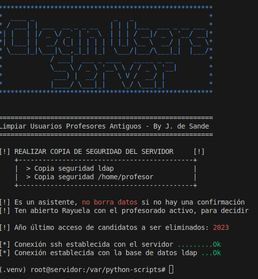

# Asistente para la limpieza de usuarios antiguos del sistema.

Cometido: Este script asiste interactivamente para borrar usuarios del sistema cuya fecha de último acceso sea anterior a una dada.

 

 ## Casos de uso